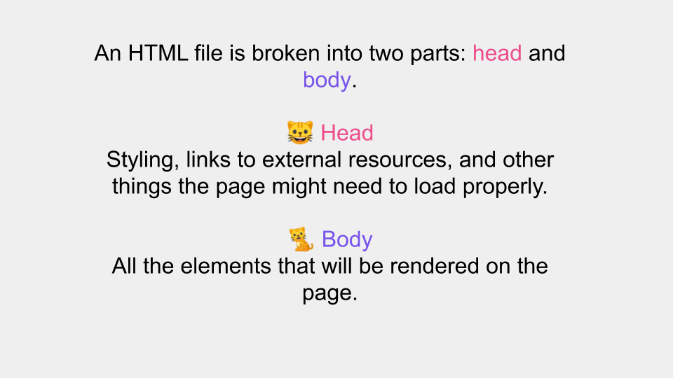
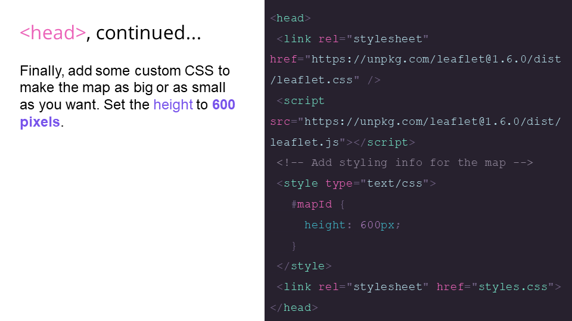
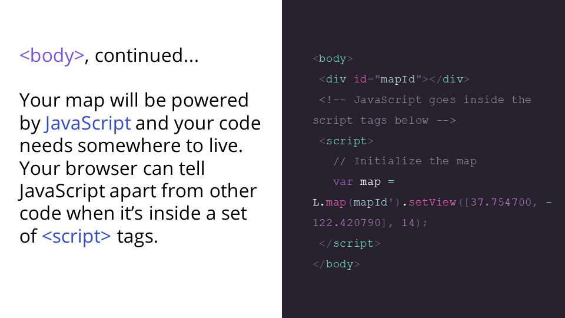
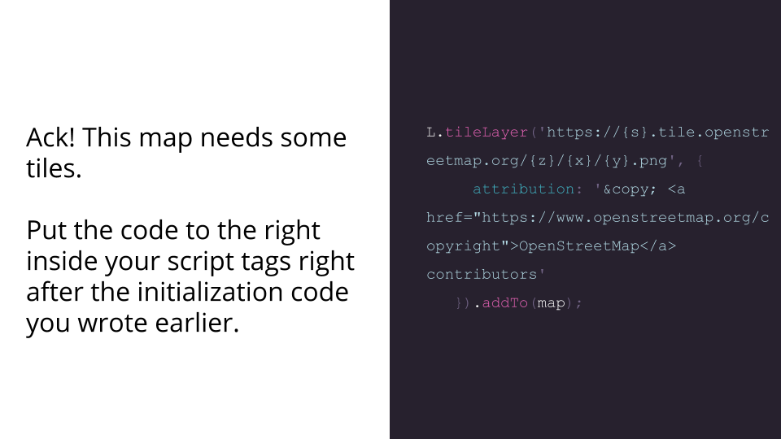

# Raster tiles with Leaflet

- Head to http://bit.ly/leaflet-basic in a new tab.
- View the page’s source code- right-click anywhere, then click View Page Source.

### Initialize your first web map
1. Fire up your text editor. In this class, we’ll be using Visual Studio Code (aka “VS Code”). Web mappers rely heavily on their text editors to get stuff done. We’re going to use ours a lot during this class.
2. In VS Code, add the folder containing all of today’s class materials to your Workspace (you should have downloaded this from GitHub already): From the File menu, click Add Folder to Workspace, then navigate to today’s class folder on your computer and click Add.
3. Open index.html


---

---
#### 4. 


```css
#mapId {
     height: 600px;
   }
 ```

#### 5.

```html
<div id="mapId"></div>
```

#### 6.

```js
var map = L.map('mapId').setView([37.754700, -122.420790], 14);
```

---


#### 7.

#### 8.



``` js
L.tileLayer('https://{s}.tile.openstreetmap.org/{z}/{x}/{y}.png', {
     attribution: '&copy; <a href="https://www.openstreetmap.org/copyright">OpenStreetMap</a> contributors'
   }).addTo(map);
```

Save your file and open the file in a browser.

---
Neat! You’re looking at the default tiles from [OpenStreetMap](https://www.openstreetmap.org/#map=5/38.007/-95.844). 

What if you want to add different tiles? You can do that! Here’s another 😎 cool example from [Stamen](https://stamen.com/). Find more examples [here](https://leaflet-extras.github.io/leaflet-providers/preview/).
